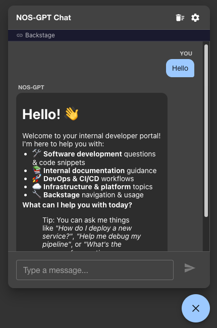
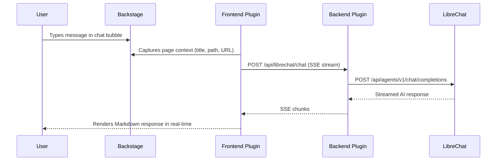

<div align="center">

# 💬 Backstage Plugin: LibreChat AI Chat

**AI-powered chat assistant, right inside your Backstage developer portal.**

Ask questions about the page you're viewing, get contextual answers, and chat with your AI agent — all through a floating chat bubble powered by your own [LibreChat](https://www.librechat.ai/) instance.

[](LICENSE)
[](https://nodejs.org/)
[](https://backstage.io/)

</div>

<br/>

<div align="center">



</div>

---

## ✨ Features

| Feature                       | Description                                                               |
| ----------------------------- | ------------------------------------------------------------------------- |
| 💬 **Floating Chat Bubble**   | Persistent AI chat overlay across all Backstage pages                     |
| 📄 **Page Context Awareness** | Automatically sends the current page title, path, and URL to the agent    |
| ⚡ **Streaming Responses**    | Real-time SSE streaming from the LibreChat Agents API                     |
| 📝 **Markdown Rendering**     | Full GitHub Flavored Markdown support (code blocks, tables, lists)        |
| 🔐 **Secure Backend Proxy**   | API keys stay server-side in `app-config.yaml`                            |
| 🔑 **User API Key Override**  | Users can provide their own API key via in-chat settings                  |
| ✅ **API Key Validation**     | Test your API key with a single click — response appears as a chat bubble |
| ⚙️ **Configurable**           | Agent ID and base URL set centrally; users only manage their API key      |

---

## 📦 Packages

| Package                                     | Description                                               |
| ------------------------------------------- | --------------------------------------------------------- |
| `@nospt/backstage-plugin-librechat`         | Frontend plugin — chat bubble, settings, streaming client |
| `@nospt/backstage-plugin-librechat-backend` | Backend plugin — proxies requests to LibreChat            |

---

## 🚀 Getting Started

Installation and configuration instructions live in each plugin's README:

- **[Frontend plugin →](plugins/librechat/README.md)** — chat bubble, settings, streaming client
- **[Backend plugin →](plugins/librechat-backend/README.md)** — proxies requests to LibreChat

---

## 📄 Page Context

Every message you send includes the current Backstage page context:

- **Page title** — e.g., `"my-service — Backstage"`
- **Page path** — e.g., `/catalog/default/component/my-service`
- **Full URL** — the complete URL of the page

This context is injected as a `system` message so the AI agent can provide relevant answers about the catalog entity, TechDocs page, or any other Backstage content you're viewing.

A small **context bar** below the chat header shows which page is currently being shared.

---

## ⚙️ How It Works



---

## 🛠️ Local Development

### Setup

```bash
# Install dependencies
yarn install

# Configure your LibreChat instance
# Edit app-config.yaml with your baseUrl, agentId, and optionally apiKey

# Start both frontend and backend
yarn start:dev

# Or start them separately:
yarn start           # Frontend dev server (port 3000)
yarn start:backend   # Backend dev server (port 7007)
```

---

## 🛡️ Security

| Concern              | How it's handled                                                                                                                 |
| -------------------- | -------------------------------------------------------------------------------------------------------------------------------- |
| **API key storage**  | Default key in `app-config.yaml` (server-side, `@visibility secret`). User overrides stored in browser via Backstage Storage API |
| **Backend proxy**    | All LibreChat requests go through the backend — API keys never exposed to the browser                                            |
| **Input validation** | Messages validated for role, length, and format before proxying                                                                  |
| **Agent ID**         | Sanitized with strict alphanumeric pattern; configured server-side only                                                          |

---

<div align="center">

**Made with ❤️ by [NOS Inovação](https://github.com/nosportugal)**

</div>
